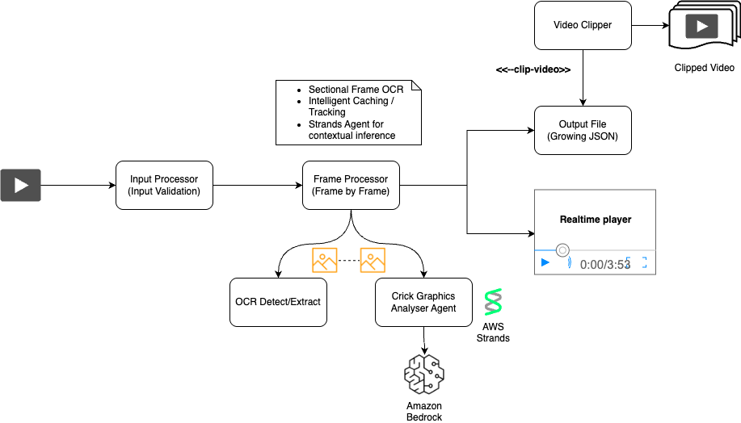

# Cricket Ball-by-Ball Analysis and Video Clipper

A comprehensive system for extracting and analyzing cricket information from video streams using OCR, AI analysis, and video processing. The system provides near real-time cricket over and score detection with optional video clipping capabilities.

## 🏗️ Solution Architecture

<p align="center">
  
</p>

## 🏏 Key Features

### Real-Time Cricket Analysis
- **Over Detection**: Recognizes cricket over format (X.Y notation) in real-time
- **Score Tracking**: Extracts team scores in multiple formats in video streams.
- **Ball-by-Ball Logging**: Tracks individual ball events with timestamps
- **Highlight Detection**: Identifies boundaries (4s, 6s), wickets, and exceptional plays
- **Over Statistics**: Calculates runs, wickets, and performance metrics per over

### AI-Powered Analysis
- **AWS Strands Integration**: Uses Bedrock Nova Lite for intelligent cricket analysis
- **Pattern Matching Fallback**: Works without AI using regex-based detection
- **Confidence Scoring**: Provides reliability metrics for detected information
- **Context-Aware Processing**: Understands cricket terminology and formats

### Performance Optimizations
- **Intelligent Caching**: Bounding box and text similarity caching
- **Frame Skipping**: Configurable processing rate for performance tuning
- **GPU Acceleration**: Apple M3 Metal and CUDA support for OCR
- **Real-Time Monitoring**: Live performance statistics and optimization metrics

### Video Processing
- **Multiple Input Sources**: Local files (VOD)
- **Video Clipping**: Optional ball-by-ball and over-level video segmentation
- **Format Support**: Works with various video formats and codecs

## 🏗️ Architecture

The project follows a modular architecture with specialized components:

```
src/
├── text_extract/           # OCR and text detection
│   └── ocr_processor.py    # EasyOCR integration with caching
├── agent/                  # AI-powered analysis
│   └── cricket_analyzer_agent.py  # Cricket-specific analysis
├── processor/              # Processing coordination
│   ├── input_processor.py  # Video input handling
│   └── frame_processor.py  # Frame-by-frame coordination
└── clipper/                # Video processing
    └── video_clipper.py    # Video clipping and segmentation
```

## 📦 Installation

### System Requirements
- **Python**: 3.8 or higher (3.12 recommended)
- **Operating System**: Windows, macOS, or Linux

## 🚀 Quick Start with UV (Recommended for Deployment)

UV is a fast Python package installer and resolver, perfect for production deployments.

### Install UV
```bash
# macOS and Linux
curl -LsSf https://astral.sh/uv/install.sh | sh

# Windows (PowerShell)
powershell -c "irm https://astral.sh/uv/install.ps1 | iex"

# Alternative: Install via pip
pip install uv
```

### Setup Project with UV
```bash
# Clone the repository
git clone <repository-url>
cd sample-amazon-bedrock-cricket-ball-by-ball-clipper

# Create virtual environment and install dependencies
uv venv
source .venv/bin/activate  # On Windows: .venv\Scripts\activate

# Install all dependencies
uv pip install -r requirements.txt

# Verify installation
python -c "import cv2, easyocr, torch; print('✅ All dependencies installed successfully')"
```

### Run with UV Environment
```bash
# Activate environment
source .venv/bin/activate  # On Windows: .venv\Scripts\activate

# Basic usage
python main.py video.mp4

# Bottom-left corner (40% width, 30% height) focused for the OCR ( Decided based ont4he score and over graphics)
python main.py video.mp4 --ocr-region 0.0 0.8 0.4 0.2

# Skips 3 frames while processing and no CV2 player diaplayed real time for frames.
python main.py video.mp4 --no-video --frame-skip 3

```

## 📊 Output Files

The system generates comprehensive output files in the `output/` directory:

### JSON Data Files
- **`{video_name}_ball_by_ball_log.json`**: Sequential ball-by-ball data with timestamps
- **`{video_name}_over_aggregation.json`**: Grouped over-level statistics and highlights

### Video Clips (when enabled)
- **`{video_name}_ball_clips/`**: Individual ball video segments
- **`{video_name}_over_clips/`**: Complete over video segments

### Example JSON Structure
```json
{
  "ball_by_ball_log": [
    {
      "over_value": "4.5",
      "over_number": 5,
      "ball_number": 5,
      "over_description": "Over 5, ball 5 completed",
      "start_time": 125.50,
      "end_time": 131.25,
      "duration": 5.75,
      "score": "156/3",
      "runs_scored": 4,
      "highlight": true,
      "highlight_type": "boundary",
      "highlight_reasons": ["boundary_4"]
    }
  ],
  "total_balls_tracked": 42,
  "status": "completed"
}
```

## UV Clean Up

```bash
# Remove environment
deactivate
rm -rf .venv
```


## 🐛 Troubleshooting

### Common Issues

#### OCR Not Working
```bash
# Check GPU availability
python -c "import torch; print(torch.cuda.is_available())"  # CUDA
python -c "import torch; print(torch.backends.mps.is_available())"  # Apple Metal

# Disable GPU if issues
python main.py video.mp4 --no-gpu
```

### Contributing

See [CONTRIBUTING](CONTRIBUTING.md#security-issue-notifications) for more information.

## 📄 License

This library is licensed under the MIT-0 License. See the LICENSE file.

> [!CAUTION]
> This system is a proof of concept for educational purposes only, not intended for production use. If implemented in real environments, please follow [responsible AI](https://aws.amazon.com/ai/responsible-ai/) practices and comply with [Amazon Bedrock Guardrails](https://aws.amazon.com/bedrock/guardrails/) that implement safeguards customized to your application requirements and responsible AI policies
